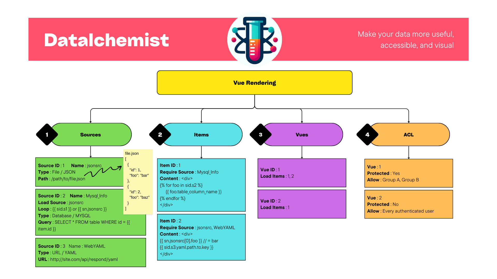
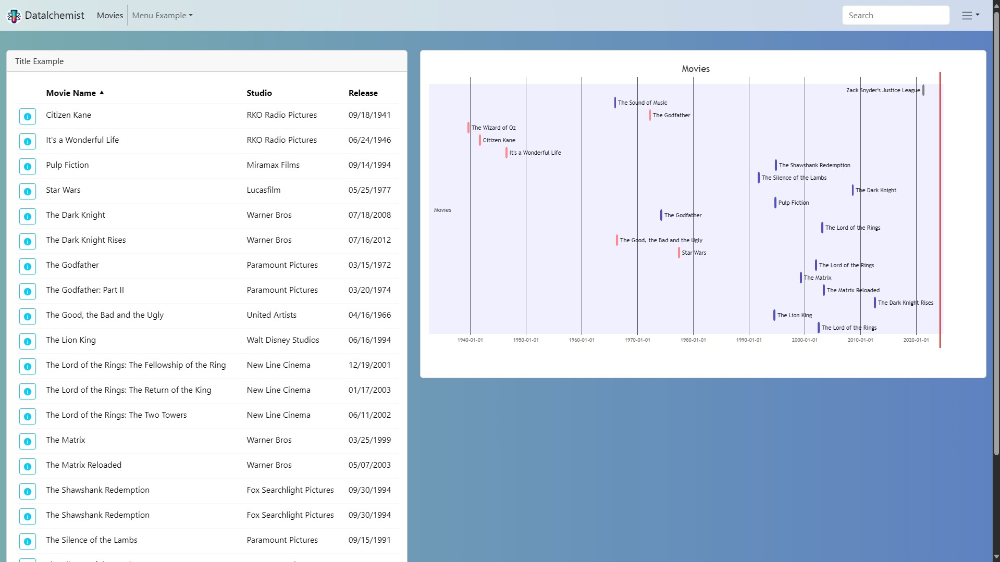

# Datalchemist

## Screenshot

## Installation
### Build
#### Requirement for build
- [npm](https://nodejs.org/en/download)
- [go](https://go.dev/dl/)
#### Commands for build
```bash
git clone https://github.com/Ookami-Git/datalchemist.git
cd datalchemist/web
npm install
npm run build
cd ..
go build
```
### Compilated
Download last version from releases and run it.
## Options
- Listen : Configure listen host and port, default value is 0.0.0.0:8080
- Database : Configure SQLITE database path, default value is datalchsmist.sqlite in the same directory as application
- Session : Configure time before session expiration in minutes, default value is 3600
### Parameters
You can use app parameters
```shell
  -d, --database string
  -l, --listen   string
  -s, --session  int
```
### Configuration file
You can create configuration file named .datalchemist in yaml syntaxe in the same directory as application or $HOME
```yaml
listen:   ":8080"
database: "datalchsmist.sqlite"
session:  3600
```
### Env vars
You can usr env vars
```shell
export DA_LISTEN=":8080"
export DA_DATABASE="datalchsmist.sqlite"
export DA_SESSION=3600
```
## Getting Started
### Startup
```shell
./datalchemist &
```
Go to http://localhost:8080 with ```admin``` username and ```admin``` password.
## YAML Navigation Menu
Create your menu (navbar) with YAML syntax
```yaml
- name: Accueil
  link: /view/accueil
- name: Separator
  divider: true
- name: menu
  subitems:
    - name: item
      link: /view/item1
    - name: item2
      link: /view/item2
    - name: item3
      link: /view/item3&value=test
- name: othersite
  link: http://www.other.com
  newtab: true
  external: true
```
/!\ Multiples level submenu does **not work**
## Sources
For source Datalchemist use [GONJA](https://pkg.go.dev/github.com/noirbizarre/gonja) for templating. The syntaxe is [jinja](https://jinja.palletsprojects.com/en/) compatible.

When you use loop, you can use ```{{ item }}``` var for each iteration of loop.
## Items
### Variables
Use nunjucks syntax for vars : https://mozilla.github.io/nunjucks/templating.html
Var usage :
- With sources
>Source name : **srcFoo**  
Source id : **1**  
Var : *foo* = "hello world"  
{{ sid.s**ID**.*foo* }} => {{ sid.s**1**.*foo* }} => "hello world"  
{{ sn.**NAME**.*foo* }} => {{ sn.**srcFoo**.*foo* }} => "hello world"

- With GET vars
>http://datalchemisthost:8080/.../test?foo=foo&foo=bar&bar=foo  
{{ get.*GetVarName* }} => {{ get.*foo* }} => ["foo","bar"]  
{{ get.*GetVarName* }} => {{ get.*foo[0]* }} => "foo"  
{{ get.*GetVarName* }} => {{ get.*foo[1]* }} => "bar"  
{{ get.*GetVarName* }} => {{ get.*bar[0]* }} => "foo"

### HTML / CSS
Use bootstrap 5 with icons for html/css : https://getbootstrap.com/docs/5.3/getting-started/introduction/

### Graphs
Use mermaid for graphs : https://mermaid.js.org/intro/
Require this HTML code :
```html
<pre  class="mermaid">
	// YOUR MERMAID CODE
</pre>
```
### Example with vars / html.CSS / Graphs
## Views
TODO

## TODO / Idées
- [ ] Source -> URL -> Permettre d'utiliser ou non un proxy
- [ ] Source -> URL -> Permettre d'utiliser un user/password
- [ ] Source -> script -> Execute un script et récupère le output -> JSON/XML/YAML
- [ ] Source -> text -> Ecrire manuellement la source -> JSON/XML/YAML
- [ ] Vue -> Permettre de désactiver le padding
- [ ] Vue -> Permettre a tous les objets d'avoir la même taille ( https://getbootstrap.com/docs/5.3/components/card/#grid-cards )
- [ ] Vue -> Permettre de choisir la couleur du header
- [ ] Parametres -> Afficher le numero de version
- [ ] Parametres -> Export / Import des Sources / Objets / Vues
- [ ] Parametres -> Changer le logo (upload -> base64 -> stocké dans la BDD)
- [ ] Parametres -> LDAP -> Option (bool) pour ajouter automatiquement un utilisateur lors de sa première connexion
- [ ] Objet -> Prévisualier
- [ ] Objet -> Tableau à pages
