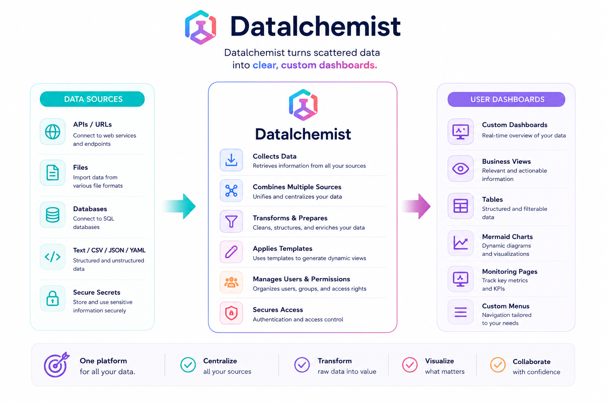

# Datalchemist

Datalchemist is an open-source data orchestration platform that makes it easy to collect, transform, and display data from databases, files, URLs, and text sources.



## 🚀 Project Overview

- Backend: Go (API + SQLite storage)
- Frontend: Vue.js + Bootstrap 5
- Data source connectors: URL, file, database, text, and script (script is flagged as risky and can be disabled)
- Templating: Gonja (Jinja-compatible) + NunJucks
- User management and authentication (default admin/admin)
- Optional encrypted secrets management
- YAML-based navigation menu for customizable dashboards

## 📁 Repository Structure

- `main.go` - app startup
- `controllers/`, `handlers/`, `routes/` - HTTP and business logic
- `database/` - SQLite connection and schema
- `models/` - domain models
- `middlewares/`, `token/`, `utils/`, `secrets/` - helper modules
- `web/` - Vue frontend static app

## 🛠️ Prerequisites

- Go 1.20+
- Node.js 16+/npm 8+

## 🧱 Build Instructions

```bash
git clone https://github.com/Ookami-Git/datalchemist.git
cd datalchemist/web
npm install
npm run build
cd ..
go build -o datalchemist .
```

## ▶️ Run the Application

```bash
./datalchemist
```

Open `http://localhost:8080`

Default login:
- username: `admin`
- password: `admin`

> Change default credentials after first login.

## ⚙️ Configuration

### Command-line options

- `-d`, `--database`  string (default `datalchsmist.sqlite`)
- `-l`, `--listen`    string (default `:8080`)
- `-s`, `--session`   int (seconds, default `3600`)
- `-k`, `--secretkey` string
- `-m`, `--secretmigration` string

### Config file

Place `.datalchemist` in the app folder or `$HOME`:

```yaml
listen: ":8080"
database: "datalchsmist.sqlite"
session: 3600
secretkey: "YourSecretKey"
```

### Environment variables

```bash
export DA_LISTEN=":8080"
export DA_DATABASE="datalchsmist.sqlite"
export DA_SESSION=3600
export DA_SECRETKEY="YourSecretKey"
```

## 🔐 Secrets Management

- Secrets are encrypted only when `--secretkey` is provided.
- Use `--secretmigration` to rotate the secret:

```bash
./datalchemist --secretkey "MyNewSecretKey" --secretmigration "MyOldSecretKey"
./datalchemist --secretkey "MyNewSecretKey"
```

- Create secrets through the UI.
- Refer to secrets in sources:

```jinja
{{ secret.secretname | secret }}
```

- Secrets cannot be used directly in object definitions from the frontend.

## 🧭 YAML Navigation Menu

```yaml
- name: Accueil
  link: /view/accueil
- name: Separator
  divider: true
- name: menu
  subitems:
    - name: item
      link: /view/item1
    - name: item2
      link: /view/item2
    - name: item3
      link: /view/item3&value=test
- name: othersite
  link: http://www.other.com
  newtab: true
  external: true
```

> Multi-level submenu does not work.

## 📡 Data Sources and Variables

- Source templating with Gonja (Jinja-compatible)
- `sid.s<sourceId>.<var>` for source variables by ID
- `sn.<sourceName>.<var>` for source variables by name
- GET variables:
  - `{{ get.foo }}` returns array (if multiple values)
  - `{{ get.foo[0] }}` returns first value

Example:

```jinja
{{ sid.s1.foo }}
{{ sn.srcFoo.foo }}
{{ get.foo[0] }}
```

## 🎨 Frontend

- Built with Vue 3.
- Key components:
  - `home`, `login`, `profil`, `view`
  - `admin` section: `acl`, `users`, `groups`, `global`
  - `edit` section: source, item, view builders
- Styles in `web/src/scss` and reusable Vue components for grid/row/item display.

## 📈 Graphs

Mermaid rendering supported in views:

```html
<pre class="mermaid">
graph TD;
  A-->B;
</pre>
```

## 🧾 Issues & Roadmap

- [X] URL source with proxy + user/password (release 0.2.2)
- [X] Text source JSON/XML/YAML (release 0.7.0)
- [X] Version display in settings (release 0.3.0)
- [X] Object preview
- [ ] Script source JSON/XML/YAML (security review required)
- [ ] View options: padding toggle, uniform object size, header color
- [ ] Export/Import of sources/objects/views
- [ ] Custom logo upload (Base64, DB-stored)
- [ ] LDAP create user on first login (configurable)
- [ ] Paginated table object

## 🧪 Development Notes

- Frontend: `cd web && npm run dev`
- Backend: `go build` and relaunch service
- Database: `datalchsmist.sqlite` in app working directory

## 🤝 Contribution

1. Fork repository
2. Create feature branch
3. Open pull request with description + tests

Merci de contribuer à Datalchemist !
