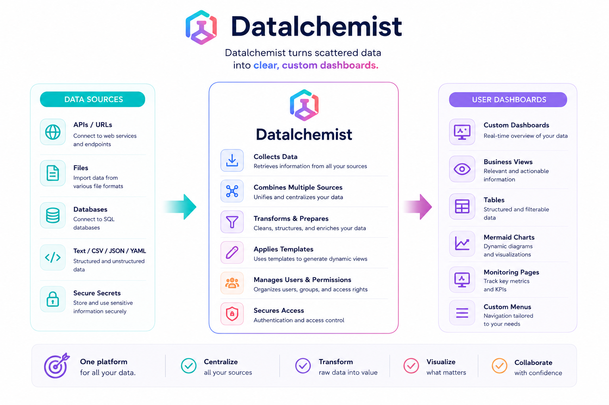

# Datalchemist

Datalchemist is an open-source data orchestration platform that makes it easy to collect, transform, and display data from databases, files, URLs, and text sources.



## 🚀 Project Overview

- Backend: Go (API + SQLite storage)
- Frontend: Vue.js + Bootstrap 5
- Data source connectors: URL, file, database, text, and script (script is flagged as risky and can be disabled)
- Templating: Gonja (Jinja-compatible) + NunJucks
- User management and authentication
- Optional encrypted secrets management
- YAML-based navigation menu for customizable dashboards

## 📁 Repository Structure

- `main.go` - app startup
- `controllers/`, `handlers/`, `routes/` - HTTP and business logic
- `database/` - SQLite connection and schema
- `models/` - domain models
- `middlewares/`, `token/`, `utils/`, `secrets/` - helper modules
- `web/` - Vue frontend static app

## 📦 Installation

Datalchemist ships as a single static binary (no runtime dependency, CGO disabled) and as a multi-arch Docker image. Pick the method that fits your environment:

| Method            | Best for                                   | Section                                           |
| ----------------- | ------------------------------------------ | ------------------------------------------------- |
| Docker            | Quickest start                             | [Option 1](#option-1--docker)                     |
| Docker Compose    | Production deployment with volume + secret | [Option 2](#option-2--docker-compose-recommended) |
| Pre-built binary  | Bare-metal / VM, systemd service           | [Option 3](#option-3--pre-built-binary)           |
| Build from source | Contributors, custom builds                | [Option 4](#option-4--build-from-source)          |
| DevContainer      | Development with live reload               | [Option 5](#option-5--devcontainer-development)   |

There is no default account: on the first start with an empty database, the web interface asks for the username and password of the first administrator, then logs you in. Unattended installations can create that account beforehand from the command line, see [First administrator and recovery](#first-administrator-and-recovery).

### Option 1 — Docker

Images are published on Docker Hub as [`ookamidock/datalchemist`](https://hub.docker.com/r/ookamidock/datalchemist) for `linux/amd64` and `linux/arm64`. Tags: `latest` and one tag per release (e.g. `0.20.0`).

```bash
docker volume create datalchemist_data

docker run -d --name datalchemist \
  -p 8080:8080 \
  -v datalchemist_data:/sqlite \
  -e DA_DATABASE=/sqlite/datalchemist.sqlite \
  -e DA_SESSION=3600 \
  --restart always \
  ookamidock/datalchemist:latest
```

Open `http://localhost:8080` and create the administrator when the interface asks for it.

`/sqlite/datalchemist.sqlite` holds all sources, objects, views, and users, so it must be kept outside the container. Use either a Docker volume as above, or a bind mount if you prefer having the SQLite file directly on the host:

```bash
-v /srv/datalchemist:/sqlite
```

To enable encrypted secrets, mount a key file and add `-e DA_SECRETKEY_FILE=/run/secrets/datalchemist_secret_key` (see [Secrets Management](#-secrets-management)).

Upgrade:

```bash
docker pull ookamidock/datalchemist:latest
docker stop datalchemist && docker rm datalchemist
# re-run the docker run command above
```

### Option 2 — Docker Compose (recommended)

The repository ships a ready-to-use [`compose.yml`](compose.yml): it publishes port 80, persists the database in the `data` volume, and mounts the encryption key as a Docker secret.

Here too, to keep the SQLite file on the host instead of a Docker volume, replace the service volume with a path and drop the top-level `volumes:` block:

```yaml
volumes:
  - ./data:/sqlite/
```

Generate the secret key first (the Compose file expects `./secrets/datalchemist_secret_key`):

```bash
install -d -m 700 secrets
openssl rand -base64 48 > secrets/datalchemist_secret_key
chmod 600 secrets/datalchemist_secret_key
```

Then start the stack:

```bash
docker compose up -d
docker compose logs -f
```

Open `http://localhost` and create the administrator when the interface asks for it.

Upgrade:

```bash
docker compose pull
docker compose up -d
```

### Option 3 — Pre-built binary

Archives for Linux, macOS, and Windows (`amd64`, `arm64`, and `386` except on Windows) are attached to every [GitHub release](https://github.com/Ookami-Git/datalchemist/releases). Release tags carry no `v` prefix.

```bash
VERSION=x.y.z
curl -fLO "https://github.com/Ookami-Git/datalchemist/releases/download/${VERSION}/datalchemist_${VERSION}_Linux_x86_64.tar.gz"
tar -xzf "datalchemist_${VERSION}_Linux_x86_64.tar.gz"
```

Adjust the archive name to your platform: `Darwin_arm64`, `Windows_x86_64.zip`, `Linux_arm64`, `Linux_i386`.

**Rootless** — nothing to install: the archive contains a self-contained binary, make it executable and run it from the directory where the database should live:

```bash
chmod +x datalchemist
./datalchemist
```

Open `http://localhost:8080` and create the administrator when the interface asks for it.

**System-wide** — install the binary in the `PATH`:

```bash
sudo install -m 755 datalchemist /usr/local/bin/datalchemist
```

Then, to run it as a service, a minimal systemd unit (`/etc/systemd/system/datalchemist.service`):

```ini
[Unit]
Description=Datalchemist
After=network-online.target

[Service]
User=datalchemist
WorkingDirectory=/var/lib/datalchemist
Environment=DA_LISTEN=:8080
Environment=DA_DATABASE=/var/lib/datalchemist/datalchemist.sqlite
Environment=DA_SECRETKEY_FILE=/etc/datalchemist/secretkey
ExecStart=/usr/local/bin/datalchemist
Restart=always

[Install]
WantedBy=multi-user.target
```

```bash
sudo systemctl daemon-reload
sudo systemctl enable --now datalchemist
```

### Option 4 — Build from source

Prerequisites:

- Go 1.25+
- Node.js 22+ with pnpm 11+ (releases are built with Node 24). pnpm is pinned by
  the `packageManager` field in `web/package.json`; run `corepack enable pnpm`
  once and the correct version is used automatically.

The Vue frontend is compiled into `web/dist` and embedded in the Go binary, so the frontend must be built first:

```bash
git clone https://github.com/Ookami-Git/datalchemist.git
cd datalchemist/web
corepack enable pnpm
pnpm install --frozen-lockfile
pnpm build
cd ..
go build -o datalchemist .
./datalchemist
```

Open `http://localhost:8080`.

To reproduce the release pipeline locally (all platforms + Docker images), install [GoReleaser](https://goreleaser.com/) and run `goreleaser release --snapshot --clean`.

### Option 5 — DevContainer (development)

For contributing, the repository provides a devcontainer with Go live reload (`air`), Vite HMR, and a Caddy reverse proxy:

```bash
docker compose -f .devcontainer/docker-compose.yml up --build
```

Or open the workspace in VS Code with the **Dev Containers** extension and choose "Reopen in Container". Full details in [`.devcontainer/README.md`](.devcontainer/README.md).

## ⚙️ Configuration

### Command-line options

- `-d`, `--database` string (default `datalchsmist.sqlite`)
- `-l`, `--listen` string (default `:8080`)
- `-s`, `--session` int (seconds, default `3600`)
- `-k`, `--secretkey` string
- `--secretkey-file` string
- `-m`, `--secretmigration` string
- `--secretmigration-file` string
- `--bootstrap-admin-username` string (default `admin`)
- `--bootstrap-admin-password-file` string
- `--reset-admin-username` string (default `admin`)
- `--reset-admin-password-file` string

### Config file

Place `.datalchemist` in the app folder or `$HOME`:

```yaml
listen: ":8080"
database: "datalchsmist.sqlite"
session: 3600
secretkey: "YourSecretKey"
```

### Environment variables

```bash
export DA_LISTEN=":8080"
export DA_DATABASE="datalchsmist.sqlite"
export DA_SESSION=3600
export DA_SECRETKEY_FILE="/run/secrets/datalchemist_secret_key"
export DA_BOOTSTRAP_ADMIN_PASSWORD_FILE="/run/secrets/bootstrap_admin_password"
```

## First administrator and recovery

As long as the database contains no user, the interface serves a creation form instead of the login page and the server logs `No administrator exists yet`. Fill in a username and a password matching the [password policy](#password-policy): the account is created with administrator rights and the session starts right away. The endpoint behind that form only works on an empty user table, so it cannot be replayed later to add an administrator — which also means a freshly started instance should not be left exposed before the account is created.

For an unattended installation, create the account beforehand from the command line. It creates the account and exits without starting the web service; the interface then serves the regular login page.

```bash
./datalchemist --bootstrap-admin-username admin --bootstrap-admin-password-file /run/secrets/bootstrap_admin_password
```

If every administrator loses access, run the local break-glass command from an environment that has access to the SQLite volume. It only resets an existing local administrator and then exits without starting HTTP.

```bash
./datalchemist --reset-admin-username admin --reset-admin-password-file /run/secrets/recovery_admin_password
```

Do not keep either password file mounted in the web-service container after the operation. Keep at least two named administrator accounts.

## Password policy

Every password a user chooses — first administrator, break-glass reset, self-service change — must contain at least 12 characters, one lowercase letter, one uppercase letter, one digit and one special character. The rule is enforced server-side in `database.ValidatePassword` and mirrored in the interface by `web/src/utils/password.js`, which shows the checklist live while typing.

Local users change their own password from **My account → Security**. The form asks for the current password, so a stolen session alone cannot take over the account. LDAP accounts have no local password: the section only points to the directory, and the API refuses the change.

## 🔐 Secrets Management

- Secrets are encrypted only when `--secretkey` or `--secretkey-file` is provided. Prefer `--secretkey-file`: passing a key as an environment variable or command-line argument makes it easier to expose through process inspection.
- The supplied Compose file expects a local Docker secret at `./secrets/datalchemist_secret_key`. Generate it once and keep it outside version control:

```bash
install -d -m 700 secrets
openssl rand -base64 48 > secrets/datalchemist_secret_key
chmod 600 secrets/datalchemist_secret_key
```

- Use `--secretmigration` to rotate the secret:

```bash
./datalchemist --secretkey-file /run/secrets/new_key --secretmigration-file /run/secrets/old_key
./datalchemist --secretkey-file /run/secrets/new_key
```

- Create secrets through the UI.
- Refer to secrets in sources:

```jinja
{{ secret.secretname | secret }}
```

- Secrets cannot be used directly in object definitions from the frontend.

## 🧭 YAML Navigation Menu

```yaml
- name: Accueil
  link: /view/accueil
- name: Separator
  divider: true
- name: menu
  subitems:
    - name: item
      link: /view/item1
    - name: item2
      link: /view/item2
    - name: item3
      link: /view/item3&value=test
- name: othersite
  link: http://www.other.com
  newtab: true
  external: true
```

> Multi-level submenu does not work.

## 📡 Data Sources and Variables

- Source templating with Gonja (Jinja-compatible)
- `sid.s<sourceId>.<var>` for source variables by ID
- `sn.<sourceName>.<var>` for source variables by name
- GET variables:
  - `{{ get.foo }}` returns array (if multiple values)
  - `{{ get.foo[0] }}` returns first value

Example:

```jinja
{{ sid.s1.foo }}
{{ sn.srcFoo.foo }}
{{ get.foo[0] }}
```

## 🎨 Frontend

- Built with Vue 3.
- Key components:
  - `home`, `login`, `profil`, `view`
  - `admin` section: `acl`, `users`, `groups`, `global`
  - `edit` section: source, item, view builders
- Styles in `web/src/scss` and reusable Vue components for grid/row/item display.

## 📈 Graphs

Mermaid rendering supported in views:

```html
<pre class="mermaid">
graph TD;
  A-->B;
</pre>
```

### Interactive graphs (Vue Flow)

Item templates are rendered as HTML through `v-html`, which cannot instantiate a
Vue component. Vue Flow is therefore mounted as an *island*: the template only
declares a container plus a JSON configuration, and the item mounts a real Vue
Flow instance inside it after rendering.

```html
<div data-vueflow>
{
  "aspectRatio": "16/9",
  "fitViewOnInit": true,
  "nodes": [
    { "id": "1", "type": "input", "position": {"x": 0, "y": 0}, "label": "Source" },
    { "id": "2", "position": {"x": 220, "y": 0}, "label": "Object" }
  ],
  "edges": [
    { "id": "e1-2", "source": "1", "target": "2", "type": "smoothstep", "animated": true }
  ]
}
</div>
```

The configuration can be generated from the item data, `{{ myFlow | dump }}`
included: HTML entities produced by the Nunjucks autoescape are decoded by the
browser when the island is read, so `| safe` is not required.

`nodes` and `edges` are passed to Vue Flow untouched, so every node and edge
option of the library is available. Any key that is not listed below is
forwarded as a `<VueFlow>` prop (`snapToGrid`, `minZoom`, `connectionMode`,
`nodesDraggable`, `defaultViewport`, …).

Island-level keys:

| Key               | Default            | Purpose                                                             |
| ----------------- | ------------------ | ------------------------------------------------------------------- |
| `height`          | `"400px"`          | Fixed height in pixels, or `"fill"` (see below)                     |
| `aspectRatio`     | –                  | `"16/9"`, `"16:9"` or a number: height derived from the width        |
| `minHeight`       | `120px` if computed | Lower bound for the computed modes                                  |
| `maxHeight`       | –                  | Upper bound                                                         |
| `fillTarget`      | `".card-body"`     | Reference box for `"fill"`                                          |
| `fitViewOnResize` | `fitViewOnInit`    | Re-frame the graph after a resize                                   |
| `background`      | dots               | `false` to disable, or the `<Background>` props                      |
| `controls`        | enabled            | `false` to disable                                                  |
| `minimap`         | disabled           | `true`, or the `<MiniMap>` props                                     |

Vue Flow renders nothing in a zero-height container, and the two view layouts do
not offer the same constraint, so pick the sizing mode accordingly:

- `aspectRatio` — the width is always defined in both layouts, so this is the
  responsive default and the safest choice for a view mixing grid and row.
- `height: "fill"` — takes the height left in the surrounding `.card-body`.
  Intended for a **grid** widget with `autoResize` **off**, where the widget
  height is fixed by `gs-h`. In a row layout the card is stretched by the
  tallest column of the line, so the flow fills that height and falls back to
  `minHeight` when it is the only content. It cannot be combined with a grid
  widget in `autoResize` mode (the widget would size to the content that sizes
  itself to the widget); that case logs a warning and falls back to a fixed
  height. The measurement assumes the island is the last block of the card:
  markup placed after it is not subtracted and would overflow.
- `height: "<n>px"` — fixed, predictable everywhere, and the only mode that
  makes a grid widget in `autoResize` mode grow to the graph.

Vue Flow options that are not JSON-serialisable (`nodeTypes`/`edgeTypes`
components, validation callbacks, slots) are not available from a template.
Custom node components must be added to the registry in
`web/src/components/view/items/VueFlowIsland.vue` and referenced by name:
`"nodeTypes": { "custom": "statusCard" }`.

Interactions are bridged as DOM events on the container, so the item's
`javascript` field can react to them:

```js
document.addEventListener('vueflow:nodeClick', (e) => {
  console.log(e.detail.node.id);
});
```

Available events: `vueflow:nodeClick`, `vueflow:nodeDoubleClick`,
`vueflow:edgeClick`, `vueflow:connect`, `vueflow:paneClick`.

## 🧾 Issues & Roadmap

- [x] URL source with proxy + user/password (release 0.2.2)
- [x] Text source JSON/XML/YAML (release 0.7.0)
- [x] Version display in settings (release 0.3.0)
- [x] Object preview
- [ ] Script source JSON/XML/YAML (security review required)
- [ ] View options: padding toggle, uniform object size, header color
- [ ] Export/Import of sources/objects/views
- [ ] Custom logo upload (Base64, DB-stored)
- [ ] LDAP create user on first login (configurable)
- [ ] Paginated table object

## 🧪 Development Notes

- Frontend: `cd web && pnpm dev`
- Backend: `go build` and relaunch service
- Database: `datalchsmist.sqlite` in app working directory

## 🤝 Contribution

1. Fork repository
2. Create feature branch
3. Open pull request with description + tests

Merci de contribuer à Datalchemist !
